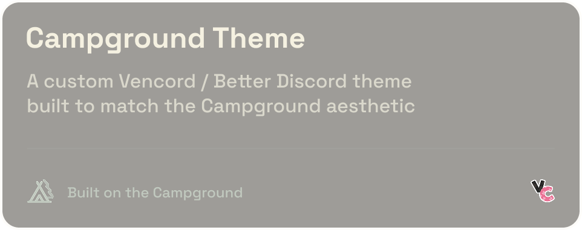

# 🏕️ Campground Theme

A cozy, clean Discord theme inspired by late-night campfires and warm lantern light.
Built for **Vencord** and **BetterDiscord**.

---

## Installation

### Vencord

1. Open Discord → **Settings** → **Vencord** tab → **Themes**.
2. Click **Open Themes Folder**.
3. Drop the `campground.theme.css` file inside that folder.
- **Windows path (manual method):**
  Navigate to `C:\Users\<your_name>\AppData\Roaming\Vencord\themes` and drop the file in there.
4. Back in Discord, enable **Campground** from the themes list.

---

### BetterDiscord
1. Open Discord → **Settings** → **BetterDiscord** tab → **Themes**.
2. Click **Open Themes Folder**.
3. Move the `campground.theme.css` file there.
- **Windows path (manual method):**
  Navigate to `C:\Users\<your_name>\AppData\Roaming\BetterDiscord\themes` and drop the file in there.
4. Back in Discord, enable **Campground** from the themes list.

---

## ⚠️ Disclaimer
**Use at your own risk.**
Modifying Discord with third-party clients or themes (including Vencord and BetterDiscord) is **against Discord's Terms of Service**.

Campground and its contributors are **not responsible** for any issues, bans, or account actions that may result from its use.

Always back up your data and proceed with caution.

---

## Notes
- Designed for dark mode (light mode not supported, *yet*)
- May require updates after Discord UI changes
- Contributions, suggestions, or bug reports are welcome via pull request or issue

---

We would love you to be a part of our amazing Discord community! [Join here](https://discord.gg/CPec6Xgn38)
